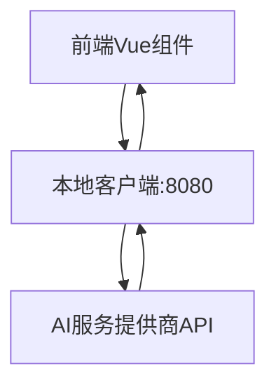
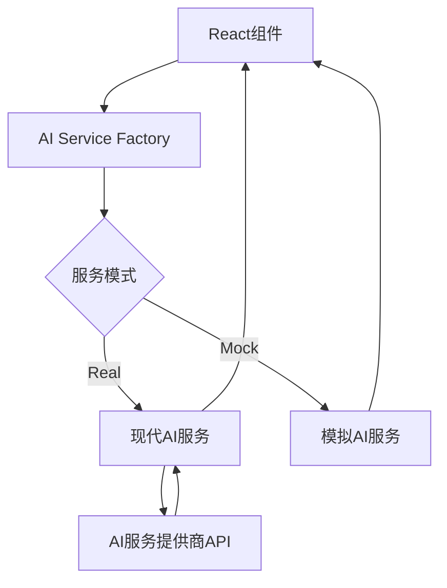

# AI对话功能集成 - 技术架构对比分析

## 📊 项目概况对比

| 特性维度 | 当前项目 (mind-map) | 源项目 (ai-talk) |
|----------|---------------------|-------------------|
| **技术栈** | Vue 2 + Element UI | React + TypeScript |
| **构建工具** | Webpack | Create React App |
| **AI服务架构** | 本地客户端代理 | 直接API调用 |
| **数据流管理** | Vuex | React Context |
| **UI组件库** | Element UI | 自定义组件 |
| **思维导图引擎** | simple-mind-map (自研) | Canvas自绘 |

---

## 🏗️ AI服务架构深度对比

### 当前项目 AI 架构

#### 🔄 调用流程


#### 📁 文件结构
```
web/src/
├── utils/ai.js                    # 基础AI调用工具
├── pages/Edit/components/
│   ├── AiChat.vue                 # AI聊天组件
│   ├── AiCreate.vue               # AI创建功能
│   └── AiConfigDialog.vue         # AI配置
└── store.js                       # Vuex状态管理
```

#### 🔧 核心实现特点
- **依赖本地客户端**: 需要用户安装并运行思绪思维导图客户端
- **端口转发模式**: 通过localhost:8080转发请求
- **流式处理**: 支持基础的流式响应处理
- **配置管理**: 通过Vuex管理AI配置

#### ⚠️ 存在问题
1. **用户体验**: 需要额外安装客户端程序
2. **部署复杂**: 客户端需要单独维护和分发
3. **兼容性**: 依赖操作系统环境
4. **调试困难**: 多层代理增加调试复杂度

### 源项目 AI 架构

#### 🔄 调用流程


#### 📁 文件结构
```
ai-talk/src/
├── services/
│   ├── ai.ts                      # 现代AI服务实现
│   ├── aiServiceFactory.ts       # 服务工厂
│   └── mockAI.ts                  # 模拟AI服务
├── hooks/
│   └── useAI.ts                   # AI功能Hook
└── features/ai/
    └── utils/contextPrompt.js     # 上下文提示词
```

#### 🔧 核心实现特点
- **直接API调用**: 无需本地客户端，直接调用AI API
- **服务工厂模式**: 支持真实API和模拟服务切换
- **TypeScript支持**: 完整的类型定义和检查
- **现代化架构**: 基于Hook和Context的状态管理
- **流式响应**: 完善的流式响应处理机制

#### ✅ 优势分析
1. **零依赖部署**: 无需额外客户端安装
2. **开发友好**: 支持模拟模式便于开发调试
3. **类型安全**: TypeScript提供完整的类型保护
4. **架构清晰**: 职责分离，易于维护扩展

---

## 🎯 集成策略技术分析

### 方案1: 完全替换 (推荐)

#### 实施方案
- 保留现有AI功能作为兼容选项
- 引入源项目的现代AI服务架构
- 通过配置开关支持两种模式

#### 技术实现
```javascript
// AI服务工厂 - 支持模式切换
class AIServiceFactory {
  constructor() {
    this.mode = localStorage.getItem('ai_service_mode') || 'modern'
  }
  
  getService() {
    switch(this.mode) {
      case 'modern':
        return new ModernAIService()  // 来自ai-talk
      case 'legacy':
        return new LegacyAIService()  // 现有实现
      default:
        return new ModernAIService()
    }
  }
}
```

#### 优势
- 用户可以选择最适合的AI服务模式
- 渐进式迁移，降低风险
- 保持向后兼容性

#### 风险
- 代码复杂度增加
- 需要维护两套AI服务代码

### 方案2: 混合集成

#### 实施方案
- 现有功能保持不变
- 新增节点自动AI回答功能使用现代架构
- 逐步迁移其他AI功能

#### 技术路线
1. **Phase 1**: 新功能使用现代AI服务
2. **Phase 2**: 迁移AI聊天功能
3. **Phase 3**: 迁移AI创建功能

---

## 🔍 关键技术挑战分析

### 挑战1: 技术栈差异

#### 问题描述
- React Hook → Vue Mixin/Composition API
- TypeScript → JavaScript
- React Context → Vuex

#### 解决方案
```javascript
// TypeScript转JavaScript示例
// 原始 TypeScript
interface AIServiceInterface {
  generateResponse(
    messages: ChatCompletionMessageParam[],
    onContent?: (content: string) => void
  ): Promise<string>;
}

// 转换后 JavaScript
/**
 * AI服务接口
 * @typedef {Object} AIServiceInterface
 * @property {Function} generateResponse - 生成AI回答
 */

// React Hook转Vue Mixin
// 原始 React Hook
const useAI = () => {
  const [isLoading, setIsLoading] = useState(false)
  // ...
}

// 转换后 Vue Mixin
const aiMixin = {
  data() {
    return {
      isLoading: false
    }
  },
  methods: {
    // AI相关方法
  }
}
```

### 挑战2: 状态管理差异

#### React Context → Vuex迁移
```javascript
// React Context (原始)
const AIContext = createContext()

// Vuex (目标)
const aiModule = {
  namespaced: true,
  state: {
    apiMode: 'modern',
    isLoading: false,
    error: null
  },
  mutations: {
    SET_API_MODE(state, mode) {
      state.apiMode = mode
    }
  },
  actions: {
    async generateResponse({ commit }, payload) {
      // AI调用逻辑
    }
  }
}
```

### 挑战3: 思维导图引擎集成

#### 节点事件监听差异
```javascript
// ai-talk: 自定义Canvas事件
canvas.addEventListener('nodeTextEdit', handleTextEdit)

// mind-map: simple-mind-map事件系统
mindMap.on('node_text_edit_end', handleTextEditEnd)
```

#### 节点创建API差异
```javascript
// ai-talk: 手动Canvas操作
const addNode = (parent, text, type) => {
  // Canvas节点创建逻辑
}

// mind-map: simple-mind-map API
mindMap.execCommand('INSERT_CHILD_NODE', parentNode, {
  text: aiResponse,
  data: { isAIResponse: true }
})
```

---

## 🛠️ 技术兼容性矩阵

| 功能模块 | 兼容性评估 | 迁移难度 | 建议方案 |
|----------|------------|----------|----------|
| **AI服务调用** | ⭐⭐⭐⭐⭐ | 简单 | 直接移植 |
| **流式响应处理** | ⭐⭐⭐⭐ | 简单 | 适配现有事件 |
| **错误处理机制** | ⭐⭐⭐⭐⭐ | 简单 | 直接移植 |
| **配置管理** | ⭐⭐⭐ | 中等 | 集成到Vuex |
| **UI组件** | ⭐⭐ | 复杂 | 重新实现 |
| **节点操作** | ⭐⭐ | 复杂 | 适配API差异 |

**图例**: ⭐⭐⭐⭐⭐ 完全兼容 | ⭐⭐⭐⭐ 基本兼容 | ⭐⭐⭐ 需要适配 | ⭐⭐ 需要重写 | ⭐ 不兼容

---

## 📋 核心代码迁移清单

### 高优先级迁移 (核心功能)

#### 1. AI服务基础类
- [ ] `ai-talk/src/services/ai.ts` → `web/src/services/ai/ModernAIService.js`
- [ ] `ai-talk/src/services/aiServiceFactory.ts` → `web/src/services/ai/aiServiceFactory.js`
- [ ] `ai-talk/src/hooks/useAI.ts` → `web/src/mixins/aiMixin.js`

#### 2. 配置管理
- [ ] API Key存储逻辑迁移
- [ ] 服务模式切换逻辑
- [ ] 连接测试功能

#### 3. 流式响应处理
- [ ] 流式数据解析逻辑
- [ ] 实时内容更新机制
- [ ] 错误恢复机制

### 中优先级迁移 (体验优化)

#### 1. 上下文提示词
- [ ] `ai-talk/src/features/ai/utils/contextPrompt.js` → `web/src/utils/contextPrompt.js`

#### 2. UI交互优化
- [ ] 加载状态显示
- [ ] 错误提示机制
- [ ] 进度显示

### 低优先级迁移 (高级功能)

#### 1. 模拟服务
- [ ] `ai-talk/src/services/mockAI.ts` → `web/src/services/ai/MockAIService.js`

#### 2. 调试工具
- [ ] 连接测试组件
- [ ] 日志记录机制

---

## 🎯 实施建议

### 推荐实施路径
1. **Phase 1**: 建立现代AI服务基础架构
2. **Phase 2**: 实现节点自动AI回答核心功能
3. **Phase 3**: 优化用户体验和错误处理
4. **Phase 4**: 添加高级功能和性能优化

### 技术决策建议
- ✅ **采用服务工厂模式**，支持多种AI服务切换
- ✅ **保留现有功能**，确保向后兼容
- ✅ **渐进式集成**，降低集成风险
- ✅ **充分测试**，确保功能稳定性

### 风险控制措施
- 🛡️ **功能开关**: 通过配置控制新功能的启用
- 🛡️ **降级方案**: 新功能失败时自动回退到现有实现
- 🛡️ **灰度发布**: 逐步向用户开放新功能
- 🛡️ **监控告警**: 实时监控新功能的运行状态

---

*本分析文档为技术集成提供详细的理论基础和实施指导，确保集成过程的科学性和可控性。* 